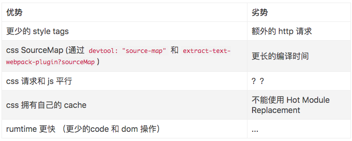
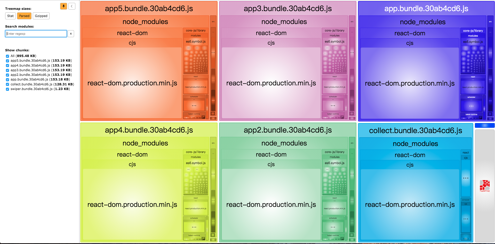
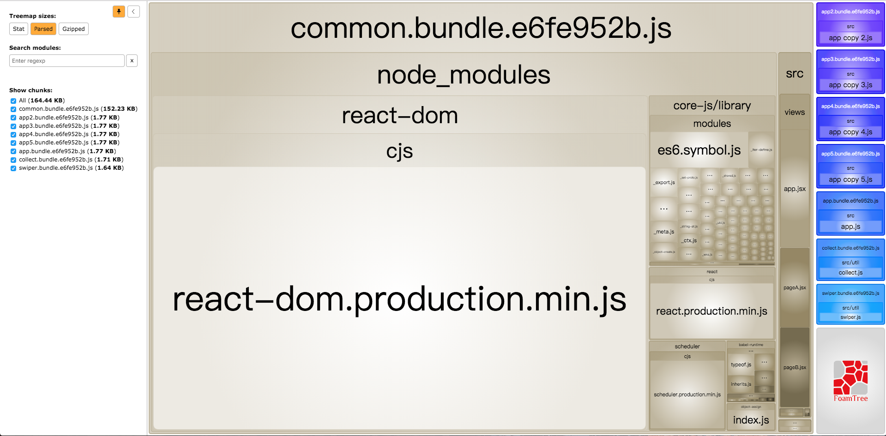
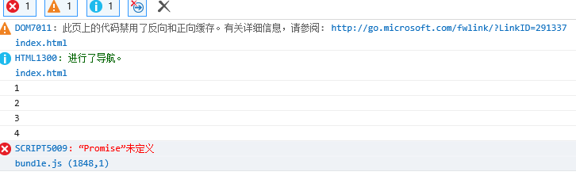

# webpack安装
webpack4 中需要全局进行安装 webpack 和 webpack-cli 。  
```shell
npm install webpack webpack-cli -g
```
然后在项目中安装 webpack  
```shell
npm install webpack --save-dev
```

# webpack 命令行打包
在 webpack@4 中，这句将表示要将 xxx.js 和 bundle.js 进行打包到 ./dist/main.js。  
在 webpack@4 中如果需要使用命令行进行打包，则使用：
```shell
webpack xxx.js --output-filename bundle.js --output-path . --mode development
```
# webpack 性能优化
## 打包速度优化
- 缩小编译范围，减少不必要的编译工作。modules、mainFields、noParse、includes、exclude、alias
例如在使用 babel-loader 对js进行编译时，可以设置 exclude 选项排除 node_modules 目录或者其他不需要进行编译的源代码, include指定需要解析的范围。以提高打包效率。
```javascript
{
  test: /\.js|jsx$/,
   include: [ // 表示只解析以下目录，减少loader处理范围
      _p("../src"),
  ],
  exclude: /(node_modules)/, 
  use: [
      {
          loader: 'babel-loader',
      }
  ]
}
```


- 通过使用 cacheDirectory 选项提高打包效率
```javascript
{
    test: /\.js$/,
    exclude: /(node_modules)/,
    use: [
        {
            loader: 'babel-loader',
            options: {
                cacheDirectory: "./cache",

            }
        }
    ]
}
```
- 开发环境 optimization.minimize 设置 false，这个是压缩bundle使用的。影响编译速度
## 项目运行优化
- 使用 splitChunks 抽离公共模块，减少输出文件大小
- 使用 extract-text-webpack-plugin 抽离 css。最后打包的文件大小可能会更大，但是有利于加载优化   

- 生产环境 optimization.minimize 设置 true（mode：'production'默认true）。压缩 bundle，减小文件大小。但是编译速度会变慢。
- 
# entry
入口起点指示webpack应该使用某个模块作为构建内部依赖图的开始。  
写法分为单个入口语法和对象语法。  
```javascript
//单个入口（简写）语法
module.exports = {
  entry: 'XXXXXX'
};
//对象语法 
module.exports = {
  entry: {
    app: 'XXXXXXXX',
    adminApp: 'XXXXXXX'
  }
};
```
向 entry 属性传入文件路径数组，将创建出一个 多主入口(multi-main entry)。在你想要一次注入多个依赖文件，并且将它们的依赖导向(graph)到一个 chunk 时，这种方式就很有用。  
这里有一个技巧，比如有一些模块不需要在开发环境下包含进来，只需要在生产环境存在，就可以在不同环境下对entry分别进行配置。

# output
告诉webpack在哪里输出创建的bundle，以及如何命名。  
```javascript
module.exports = {
  //...
  output: {
    filename: '[name].[hash].js',
    path: __dirname + '/dist'
  }
};
```

# optimization
从 webpack 4 开始，会根据你选择的 mode 来执行不同的优化，不过所有的优化还是可以手动配置和重写。  
所以为什么在使用webpack4时，只要传入 mode:'production' 就可以完成一些优化，例如代码压缩。
## [splitChunks](https://webpack.docschina.org/plugins/split-chunks-plugin/)
对于动态导入模块，默认使用 webpack v4+ 提供的全新的通用分块策略(common chunk strategy)  
栗子(参见 4-build):   
在entry多入口的情况下会打包输出多个bundle。但是如果在不同的bundle中有某些模块被多次引入，即公共模块，如果这个时候不做处理，就会在多个bundle中含有重复代码。   
在这个栗子中，多入口：
```javascript
app: _p('../src/app.js'),
app2: _p('../src/app copy 2.js'),
app3: _p('../src/app copy 3.js'),
app4: _p('../src/app copy 4.js'),
app5: _p('../src/app copy 5.js'),
```
每个入口文件都相同：
```javascript
/* === react === */
import React from 'react';
import ReactDOM from 'react-dom';
import App from '@views/app';
import '@css/index';
import '@css/base';
import '@css/reset';
ReactDOM.render(
    <App />,
    document.getElementById('app1')
)
if (module.hot) {
    module.hot.accept();
}
```
可以发现都引入了 react 和 react-dom。如果不做任何处理，最终打包的结果是：



`splitChunks使用`:
```javascript
splitChunks: {
    chunks: 'all',  // all async initial 选择对哪些块进行优化
    minSize: 0,  // 被拆分的最小大小（压缩前）
    minChunks: 6,  // 被共享的最小次数
    // maxAsyncRequests: 1,  // 最大按需求并行请次数
    // maxInitialRequests: 1,  // 最大初始化并行请求数
    // automaticNameDelimiter: '-',  // 自动命名分隔符
    // name: true, // 自动为块命名
    name:'common',
    cacheGroups: {
        vendors: {
            test: /[\\/]node_modules[\\/]/,
            priority: -10
        },
        default: {
            minChunks: 2,
            priority: -20,
            reuseExistingChunk: true
        }
    }
}
```
使用splitChunks进行处理，最终打包的结果是：



# babel编译
作用：由于js中一些新语法在旧版本浏览器中不兼容，因为有了babel工具可以将其转换成旧版本浏览器可以运行的代码。  
babel编译器：babel 编译器会从项目的根目录下的 .babelrc 文件中读取配置。主要配置的内容包含 presets-预设 和 plugins-插件。   

plugins:  
主要使用的有：babel-polyfill、 babel-runtime、 babel-plugin-transform-runtime  

babel-polyfill 和 babel-runtime 的区别：   
- babel-polyfill  
原理是将当前运行环境中没有实现的一些方法进行兼容。通过向全局对象和内置对象的prototype上添加方法来实现的。  
缺点： 造成全局空间污染  

- babel-runtime  
将es6编译成es5去执行。使用其中提供的工具函数来实现es6语法功能。

以当前项目为例，在不使用babel编译的情况，编译后的js文件大小是17kb。  
使用 babel-polifill,直接在源文件中 `import 'babel-polyfill'` 进行编译耗时1000ms，文件大小是454kb。其中搜索 'prototype' 是 351 个,这是因为 babel-polyfill 是通过添加大量原型方法来实现兼容的。   
启用插件 babel-plugin-transform-runtime ，在 .babelrc 中 plugins 进行配置。Babel 就会使用 babel-runtime 下的工具函数，转译代码,最终编译耗时640ms，文件的大小是96kb。其中搜索 'prototype' 是 56个。  

presets:  
presets属性告诉Babel要转换的源码使用了哪些新的语法特性，presets是一组Plugins的集合。
目前推荐使用 babel-preset-env：
```javascript
{
  "presets": ['env']
}
```
但是单独使用它，不能对对象解构进行编译：
```javascript
const obj1 = { name: 1 }
const obj2 = { age: 24 }
const obj = { ...obj1, ...obj2 }
console.log(obj)
```
可以添加 [transform-object-reset-spread](https://www.npmjs.com/package/babel-plugin-transform-object-rest-spread)  进行支持。  
也可以添加 [stage-0](https://www.npmjs.com/package/babel-preset-stage-0) 进行支持。  
最终配置可能是下面这个样子：  
```javascript
{
  "plugins": [
    [
      "transform-runtime",
      {
        "polyfill": false
      }
    ]
  ],
  "presets": [
    "stage-0",
    "env",
  ]
}
```
编译耗时 650ms ，编译文件大小 62kb，prototype 49个。由于 polyfill 设置 false，所以发现没有对 promise 进行编译，因而在ie中无法正常运行：
;
将 polyfill 选项设置成 true 或者不设置（默认值是true），编译耗时 730ms，编译文件大小 127kb，prototype 95个。可以发现 promise 已经做了兼容处理,此时已经能够在ie中正常运行。
```javascript
var _promise = __webpack_require__(/*! babel-runtime/core-js/promise */ "./node_modules/babel-runtime/core-js/promise.js");
```
此时发现如果代码中包含 `console.log([1, 2, 3].includes(2))` Array.prototype.includes 的使用，也是不会被编译的，在ie中还是无法正常运行。这里将使用 [polyfill-array-includes](https://www.npmjs.com/package/polyfill-array-includes) 进行polyfill


`总结`:无论是哪种编译，最终的目的都是将 es6及之后出现的新语法经过编译，变成低版本浏览器能够正常运行的代码。实质都是使用es5语法来实现代码。方式有两种，一种是直接将源代码中的逻辑用es5代码进行替换。另一种是用es5语法来实现高版本语法中的api。  
不妨可以去了解一下 [core-js](https://github.com/zloirock/core-js)。去看一下如何用es5语法来实现es6的一些api。

# webpack-dev-server
webpack-dev-server是在开发环境下能够启用一个服务进行快速开发的工具。下面列举了一些常用的配置项。
```javascript
devServer: {
    compress: true, //一切服务都启用 gzip 压缩：
    contentBase: _p('../dist'), //告诉服务器从哪个目录中提供内容。只有在你想要提供静态文件时才需要。devServer.publicPath 将用于确定应该从哪里提供 bundle，并且此选项优先。
    historyApiFallback: true, //当使用 HTML5 History API 时，任意的 404 响应都可能需要被替代为 index.html。devServer.historyApiFallback 默认禁用。在单页应用路由使用history模式的时候需要
    hot: true, //启用 webpack 的 模块热替换 功能
    publicPath: '/assets/', // 此路径下的打包文件可在浏览器中访问。
    open: true, //告诉 dev-server 在 server 启动后打开浏览器。默认禁用
    overlay: true, //当出现编译器错误或警告时，在浏览器中显示全屏覆盖层。默认禁用。
    port: 9000, //指定要监听请求的端口号
}
```

## webpack-dev-server的一些相关内容
### webpack-dev-server 为什么能够启动一个本地服务
webpack-dev-server 之所以能够启动服务来用于开发，阅读源码可以发现 Server.js 构建了一个 Server 类，其中有 listen 方法。`this.listeningApp.listen`。查看 listeningApp 发现 `this.listeningApp = https.createServer(this.options.https, this.app)`。正是使用了nodejs 中https模块的createServer。  
### webpack-dev-server 是如何实现文件访问的？（在没有编译出打包之后的文件的情况下，浏览器访问到的文件存在哪里）
https://juejin.im/post/5cabfc7bf265da035e210197  
可以看到在开发过程中，即使没有进行打包编译，硬盘中不存在打包之后的文件，我们还是能够在浏览器正常通过webpack-dev-server提供的服务进行访问，从而猜想读写过程是在内存中完成的。  
查看源码，发现有一个模块是 webpack-dev-middleware。在 webpack-dev-middleware/lib/fs.js 中，引用了 `const MemoryFileSystem = require('memory-fs');` 。
### 在react项目中热加载更好的体验
https://blog.csdn.net/huangpb123/article/details/78556652  
webpack-dev-server已经提供了热加载的功能，但是当我们修改某个组件的时候会导致刷新整个页面，发现这一点和vue的项目是不太一样。如果要实现和vue项目一样的局部刷新功能，需要安装 react-hot-loader。
- 安装 react-hot-loader
```shell
npm install --save-dev react-hot-loader
```
- entry 添加 react-hot-loader
在 webpack.config.js 的 entry 值里加上 react-hot-loader/patch，一定要写在entry 的最前面，如果有 babel-polyfill 就写在: 
```javascript
entry: {
    app: [
        "react-hot-loader/patch",
        _p('../src/app.js'),
    ]
},  
```
- webpack.config 设置 devServer 的 hot 为 true
- 在 .babelrc 里添加 plugin
```javascript
"plugins": [
  [
    "react-hot-loader/babel"
  ],
],
```
- webpack.config 的 plugins 里添加依赖的 HotModuleReplacement 插件
```javascript
const webpack = require('webpack');
module.exports = {
  //...
  plugins: [
      new webpack.HotModuleReplacementPlugin({}),
  ],  
  //...
}
```
- 页面的主入口添加些代码
```javascript
import { AppContainer } from "react-hot-loader";

const container = document.getElementById("app");
const render = Component => {
    ReactDom.hydrate(
        <AppContainer>
            <Component />
        </AppContainer>,
        container
    );
}
render(App)

if (module.hot) {
    module.hot.accept("./views/app.jsx", () => {
        const nextApp = require("./views/app.jsx").default;
        render(nextApp);
    });
}
```
或者
```javascript
ReactDOM.render(
    <App />,
    document.getElementById('app')
)

if (module.hot) {
    module.hot.accept();
}
```

# plugins

## html-webpack-plugin
HtmlWebpackPlugin简化了HTML文件的创建，以便为你的webpack包提供服务。
- 安装依赖
```shell
npm install --save-dev html-webpack-plugin
```
- 用法
该插件将为你生成一个 HTML5 文件， 其中包括使用 script 标签的 body 中的所有 webpack 包。 只需添加插件到你的 webpack 配置如下：
```javascript
const HtmlWebpackPlugin = require('html-webpack-plugin');
const path = require('path');
const _p = (src) => path.join(__dirname, src);
module.exports = {
  //...
  plugins: [
    new HtmlWebpackPlugin({
      title: 'webpack',
      template: /*模板路径*/
    })
  ] 
};
```

## extract-text-webpack-plugin
在不使用该插件的情况下，scss，css最终会编译打包进js，最后通过js动态生成style插入到html中。extract-text-webpack-plugin 的作用是分离项目中的css文件。  
建议在开发环境和生产环境进行区分：  
开发环境：只做简单的 sass-loader/less-laoder -> css-loader -> style-loader 的编译。有利于提高编译速度。  
生产环境：sass-loader/less-laoder -> postcss-loader -> css-loader -> style-loader。添加前缀。使用该插件编译成分离成css文件。  
- 安装依赖
注意extract-text-webpack-plugin的版本，在webpack@4中使用 extract-text-webpack-plugin@3会报错。这个时候我们要指定版本安装
```shell
npm i extract-text-webpack-plugin@next --save-dev
```

## clean-webpack-plugin
清理插件
- 安装依赖
```shell
npm i clean-webpack-plugin --save-dev
```
- 用法
在webpack.config plugins 中添加该插件
```javascript
const { CleanWebpackPlugin } = require('clean-webpack-plugin');
module.exports = {
  plugins: [
    new CleanWebpackPlugin(),
  ],
};
```

## webpack-bundle-analyzer 
打包分析
- 安装
```shell
npm i webpack-bundle-analyzer --save-dev
```
- 使用
```javascript
const BundleAnalyzerPlugin = require('webpack-bundle-analyzer').BundleAnalyzerPlugin;

plugins: [
    // 打包分析
    new BundleAnalyzerPlugin({
        analyzerMode: 'static',
        analyzerPort: 3000
    })
],
```

# loader
## 编译es6+
- 安装依赖
```shell
npm i babel-core babel-loader babel-plugin-transform-runtime babel-preset-env babel-preset-stage-0 --save-dev
```
- .babelrc 配置：
```javascript
{
  "plugins": [
    [
      "transform-runtime",
      {
        // "polyfill": false
      }
    ]
  ],
  "presets": [
    "stage-0",
    "env"
  ]
}
```
- webpack.config配置
```javascript
{
    test: /\.js$/,
    exclude: /(node_modules)/,
    use: [
        {
            loader: 'babel-loader',
        }
    ]
}
```
## 编译sass
- 安装依赖
```shell
npm i node-sass sass-loader style-loader css-loader --save-dev
```
- webpack.config 配置
```javascript
{
  test: /\.css|scss$/,
  use: [
      {
          loader: 'style-loader',
      }, {
          loader: 'css-loader'
      }, {
          loader: 'sass-loader'
      }
  ]
}
```
`注意`:配置scss编译的loader是从右往左执行：  
1. 执行sass-loader，将 Sass 编译成 CSS，默认使用 Node Sass
2. 执行css-loader，将 CSS 转化成 CommonJS 模块
3. 执行style-loader，将 JS 字符串生成为 style 节点  
如果是编译less，需要先安装less，`npm i less --save-dev`。然后将sass-loader替换成less-loader即可。


`如果需要给css3特性添加兼容前缀`:
- 安装依赖
```shell
npm i postcss-loader autoprefixer --save-dev
```
- 创建 postcss.config.js：
```javascript
module.exports = {
    plugins: [
        require('autoprefixer')
    ]
}
```
- webpack.config 配置添加 postcss-loader
```javascript
{
    test: /\.scss$/,
    use: [
        {
            loader: 'style-loader',
        }, {
            loader: 'css-loader'
        }, {
            loader: 'postcss-loader'
        }, {
            loader: 'sass-loader'
        }
    ]
}
```

`或者`
不创建 postcss.config.js 文件，直接给 postcss-loader 添加配置项：
```javascript
{
  loader: 'postcss-loader',
  options: {
      plugins: [
          require("autoprefixer")
      ]
  }
}
```
好处是不需要多创建一个配置文件。

## 编译react
(参见 2-react )
- 安装依赖
```shell
npm i react react-dom  babel-preset-react --save-dev
```
- 用法
presets 添加 react。  
```javascript
{
  "plugins": [ "react-hot-loader/babel", "transform-runtime" ],
  "presets": [ "stage-0", "react", "env" ]
}
```

## 编译 vue
(参见 3-vue )
- 安装依赖
```shell
npm i vue vue-loader vue-template-compiler --save-dev
```
- 使用
webpack.config 中添加loader以及plugins中添加插件
```javascript
module.exports = {
    //...
    plugins: [
        new VueLoaderPlugin(),
    ],
    module: {
        rules: [
            {
                test: /\.vue$/,
                use: ['vue-loader'],
            },
        ],
    }
}
```


# webpack@3 升级 webpack@4 注意事项

## extract-text-webpack-plugin
由于 extract-text-webpack-plugin 还有没有发布对应的正是版本，目前只有  extract-text-webpack-plugin:'4.0.0-beta.0'。  
所以在安装的时候需要指定安装版本 `npm i extract-text-webpack-plugin@next --save-dev`

## webpack.optimize.CommonsChunkPlugin
(参见 4-build )  
webpack@4中不再使用 webpack.optimize.CommonsChunkPlugin 抽离公共模块，[SplitChunksPlugin](https://webpack.docschina.org/plugins/split-chunks-plugin/) 代替其实现功能。  
## html-webpack-plugin 版本不兼容
在升级webpack4过程中，可能会报错 compilation.mainTemplate.applyPluginsWaterfall is not a function。是因为 html-webpack-plugin 版本不兼容导致的。需要对其进行升级 `npm i html-webpack-plugin@next --save-dev`